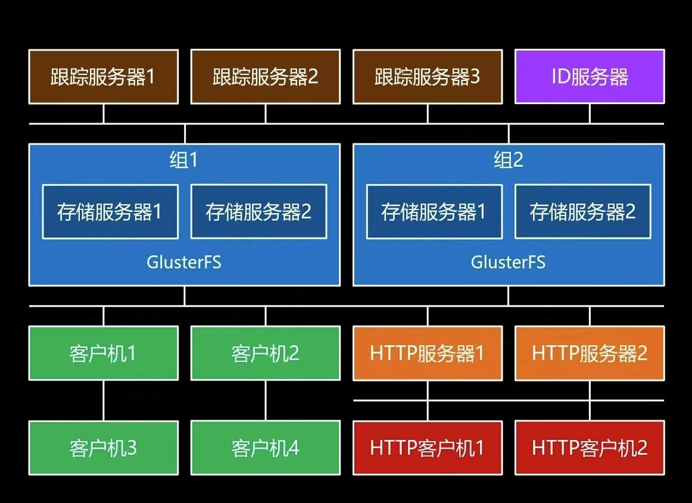
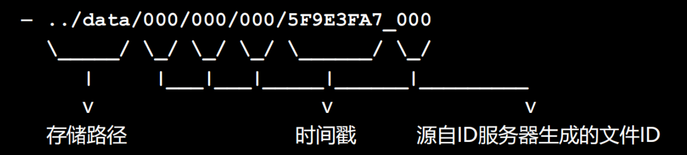
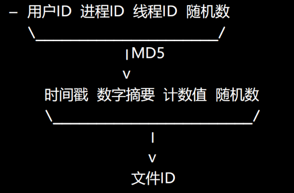

[TOC]

# 项目架构

## 架构图



# 公共模块

## 宏定义

```c++
//公共模块
//定义所有模块都会用到的宏
#include <netinet/in.h>

//定义函数返回值
const int OK = 0;             //成功
const int ERROR = -1;         //本地错误
const int SOCKET_ERROR = -2;  //套接字通信错误
const int STATUS_ERROR = -3;  //服务器状态异常

//缓存相关（redis）
const std::string TRACKER_REDIS_PREFIX = "tracker";   //跟踪服务器redis前缀
const std::string STORAGE_REDIS_PREFIX = "storage";   //存储服务器redis前缀

//存储服务器状态
typedef enum storage_status
{
    STORAGE_STATUS_OFFLINE,   //离线
    STORAGE_STATUS_ONLINE,    //在线
    STORAGE_STATUS_ACTIVE     //活动
}storage_status_t;

//存储服务器信息
const int STORAGE_VERSION_MAX = 6;       //版本信息最大字符数
const int STORAGE_GROUPNAME_MAX = 16;    //组名最大字符数
const int STORAGE_HOSTNAME_MAX = 128;    //主机名最大字符数
const int STORAGE_ADDR_MAX = 16;         //Ip地址最大字符数
//键值对  键的最大长度
const int ID_KEY_MAX = 64;

//存储服务器读写磁盘文件缓冲区
const int STORAGE_RCVWD_SIZE = 512*1024;
const int STORAGE_RDSND_SIZE = 512*1024;


//公共模块
//定义与报文规约相关的宏
#include "types.h"

/////////////////////////////////////////////////////////////////////////////
//                                                                         //
//    | 包体长度 | 命令 | 状态 |   包体     |                                 //
//    |    8    |  1   |  1   | 包体长度 |                                  //
//                                                                         //
/////////////////////////////////////////////////////////////////////////////
const int BODYLEN_SIZE = 8;                                         //包体长度字节数
const int COMMAND_SIZE = 1;                                         //命令字节数
const int STATUS_SIZE = 1;                                          //状态字节数
const int HEADLEN = (BODYLEN_SIZE + COMMAND_SIZE + STATUS_SIZE);    //包头字节数

/////////////////////////////////////////////////////////////////////////////
//                                                                         //
//    | 包体长度 | 命令 | 状态 | 错误号 | 错误描述 |                            //
//    |    8    |  1  |  1  | 2     | <=1024   |                           //
//                                                                         //
/////////////////////////////////////////////////////////////////////////////
const int ERROR_NUMB_SIZE = 2;                                     //错误号字节数
const int ERROR_DESC_SIZE = 1024;                                  //错误描述最大字节数（包含空字符）


/////////////////////////////////////////////////////////////////////////////
//                                                                         //
//    | 包体长度 | 命令 | 状态 | 应用ID | 用户ID | 文件ID |                     //
//    |    8    |  1  |  1  | 16     |   256 |  128  |                     //
//                                                                         //
/////////////////////////////////////////////////////////////////////////////
const int APPID_SIZE = 16;                                         //应用ID最大字节数（包含空字符）
const int USERID_SIZE = 256;                                       //用户ID最达字节数（包含空字符）
const int FILEID_SIZE = 128;                                       //文件ID最大字节数（包含空字符）

//命令
const int CMD_TRACKER_JOIN = 10;                               //存储服务器向跟踪服务器发送加入包
const int CMD_TRACKER_BEAT = 11;                               //存储服务器向跟踪服务器发送心跳包
const int CMD_TRACKER_SADDRS = 12;                             //客户机从跟踪服务器获取存储服务器地址列表
const int CMD_TRACKER_GROUPS = 13;                             //客户机从跟踪服务器获取组列表
const int CMD_ID_GET = 40;                                     //存储服务器从ID服务器获取ID

const int CMD_STORAGE_UPLOAD = 70;                                 //客户机向存储服务器上传文件
const int CMD_STORAGE_FILESIZE = 71;                               //客户机向存储服务器询问文件大小
const int CMD_STORAGE_DOWNLOAD = 72;                               //客户机从存储服务器下载文件
const int CMD_STORAGE_DELETE = 73;                                 //客户机删除存储服务器上的文件

const int CMD_TRACKER_REPLY = 100;                                 //跟踪服务器应答
const int CMD_ID_REPLY = 101;                                      //ID服务器应答
const int CMD_STORAGE_REPLY = 102;                                 //存储服务器应答
```


## 自定义的数据类型

```c++
//公共模块
//定义所有模块都会用到的数据类型

//存储服务器加入信息
typedef struct storage_join
{
    char sj_version[STORAGE_VERSION_MAX+1];          //版本
    char sj_groupname[STORAGE_GROUPNAME_MAX+1];      //组名
    char sj_hostname[STORAGE_HOSTNAME_MAX+1];        //主机名
    in_port_t sj_port;                               //端口号
    time_t sj_stime;                                 //启动时间
    time_t sj_jtime;                                 //加入时间
}storage_join_t;
//描述信息
typedef struct storage_info
{
    char si_version[STORAGE_VERSION_MAX+1];          //版本
    char si_hostname[STORAGE_HOSTNAME_MAX+1];        //主机名
    char si_addr[STORAGE_ADDR_MAX+1];                //ip地址
    in_port_t si_port;                               //端口号
    time_t si_stime;                                 //启动时间
    time_t si_jtime;                                 //加入时间
    time_t si_btime;                                 //心跳时间
    storage_status_t si_status;                      //存储服务器状态
}storage_info_t;

//键值对
typedef struct id_pair
{
    char id_key[ID_KEY_MAX+1];                       //键
    long id_value;                                   //值
    int id_offset;                                   //偏移量
}id_pair_t;


//公共模块
//定义与报文规约相关的数据类型
#include "types.h"

//存储服务器加入包和心跳包
//使用结构体组织信息 成员均使用char类型，防止内存补齐
typedef struct storage_join_body
{
    char sjb_version[STORAGE_VERSION_MAX+1];                       //版本
    char sjb_groupname[STORAGE_GROUPNAME_MAX+1];                   //组名
    char sjb_hostname[STORAGE_HOSTNAME_MAX+1];                     //主机名
    char sjb_port[sizeof(in_addr_t)];                              //端口号
    char sjb_stime[sizeof(time_t)];                                //启动时间
    char sjb_jtime[sizeof(time_t)];                                //加入时间
}storage_join_body_t;

typedef struct storage_beat_body
{
    char sbb_groupname[STORAGE_GROUPNAME_MAX+1];                   //组名
    char sbb_hostname[STORAGE_HOSTNAME_MAX+1];                     //主机名
}storage_beat_body_t;
```


## 实用函数

```c++
//公共模块
//实用函数
#include "types.h"
#include "proto.h"
#include <string>
#include <vector>
//long long类型整数主机序转网络序
void llton(long long ll,char* n);

//网络序转long long类型主机序
long long ntoll(char const *n);

//long类型整数主机序转网络序
void lton(long l,char* n);

//网络序转long类型主机序
long ntol(char const *n);

//short类型整数主机序转网络序
void ston(short s,char* n);

//网络序转short类型主机序
short ntos(char const *n);

//判断字符串是否合法（A-Z，a-z,0-9）
int valid(char const* str);

//拆分字符串
int splitstring(char const*str,std::vector<std::string>& substrs);
```


# 报文规约

## 跟踪服务器通信报文

### 存储服务器向跟踪服务器请求加入

#### 请求报文

<table border="1" style="width: 100%; text-align: center;">
    <tr>
        <td colspan="3">包头</td>
        <td colspan="6">包体</td>
    </tr>
    <tr>
        <td>包体长度</td>
        <td>命令（10）</td>
        <td>状态</td>
        <td>版本</td>
        <td>组名</td>
        <td>主机名</td>
        <td>端口号</td>
        <td>启动时间</td>
        <td>加入时间</td>
    </tr>
    <tr>
        <td>8</td>
        <td>1</td>
        <td>1</td>
        <td colspan="6">包体长度</td>
    </tr>
</table>


#### 成功响应

<table border="1" style="width: 100%; text-align: center;">
    <tr>
        <td colspan="3">包头</td>
    </tr>
    <tr>
        <td>包体长度</td>
        <td>命令（100）</td>
        <td>状态</td>
    </tr>
    <tr>
        <td>8</td>
        <td>1</td>
        <td>1</td>
    </tr>
</table>


#### 失败响应

<table border="1" style="width: 100%; text-align: center;">
    <tr>
        <td colspan="3">包头</td>
        <td colspan="2">包体</td>
    </tr>
    <tr>
        <td>包体长度</td>
        <td>命令（100）</td>
        <td>状态</td>
        <td>错误号</td>
        <td>错误描述</td>
    </tr>
    <tr>
        <td>8</td>
        <td>1</td>
        <td>1</td>
        <td>2</td>
        <td><=1024</td>
    </tr>
</table>


### 存储服务器向跟踪服务器发送心跳

#### 请求报文

<table border="1" style="width: 100%; text-align: center;">
    <tr>
        <td colspan="3">包头</td>
        <td colspan="2">包体</td>
    </tr>
    <tr>
        <td>包体长度</td>
        <td>命令（11）</td>
        <td>状态</td>
        <td>组名</td>
        <td>主机名</td>
    </tr>
    <tr>
        <td>8</td>
        <td>1</td>
        <td>1</td>
        <td colspan="2">包体长度</td>
    </tr>
</table>


#### 成功响应

<table border="1" style="width: 100%; text-align: center;">
    <tr>
        <td colspan="3">包头</td>
    </tr>
    <tr>
        <td>包体长度</td>
        <td>命令（100）</td>
        <td>状态</td>
    </tr>
    <tr>
        <td>8</td>
        <td>1</td>
        <td>1</td>
    </tr>
</table>


#### 失败响应

<table border="1" style="width: 100%; text-align: center;">
    <tr>
        <td colspan="3">包头</td>
        <td colspan="2">包体</td>
    </tr>
    <tr>
        <td>包体长度</td>
        <td>命令（100）</td>
        <td>状态</td>
        <td>错误号</td>
        <td>错误描述</td>
    </tr>
    <tr>
        <td>8</td>
        <td>1</td>
        <td>1</td>
        <td>2</td>
        <td><=1024</td>
    </tr>
</table>


### 客户机向从跟踪服务器获取存储服务器地址列表

#### 请求报文

<table border="1" style="width: 100%; text-align: center;">
    <tr>
        <td colspan="3">包头</td>
        <td colspan="3">包体</td>
    </tr>
    <tr>
        <td>包体长度</td>
        <td>命令（12）</td>
        <td>状态</td>
        <td>应用ID</td>
        <td>用户ID</td>
        <td>文件ID</td>
    </tr>
    <tr>
        <td>8</td>
        <td>1</td>
        <td>1</td>
        <td>16</td>
        <td>256</td>
        <td>128</td>
    </tr>
</table>


#### 成功响应

<table border="1" style="width: 100%; text-align: center;">
    <tr>
        <td colspan="3">包头</td>
        <td colspan="2">包体</td>
    </tr>
    <tr>
        <td>包体长度</td>
        <td>命令（100）</td>
        <td>状态</td>
        <td>组名</td>
        <td>存储服务器地址列表</td>
    </tr>
    <tr>
        <td>8</td>
        <td>1</td>
        <td>1</td>
        <td colspan="2">包体长度</td>
    </tr>
</table>


#### 失败响应

<table border="1" style="width: 100%; text-align: center;">
    <tr>
        <td colspan="3">包头</td>
        <td colspan="2">包体</td>
    </tr>
    <tr>
        <td>包体长度</td>
        <td>命令（100）</td>
        <td>状态</td>
        <td>错误号</td>
        <td>错误描述</td>
    </tr>
    <tr>
        <td>8</td>
        <td>1</td>
        <td>1</td>
        <td>2</td>
        <td><=1024</td>
    </tr>
</table>

### 密钥协商服务器向跟踪服务器请求加入

#### 请求报文

<table border="1" style="width: 100%; text-align: center;">
    <tr>
        <td colspan="3">包头</td>
        <td colspan="6">包体</td>
    </tr>
    <tr>
        <td>包体长度</td>
        <td>命令（14）</td>
        <td>状态</td>
        <td>版本</td>
        <td>组名</td>
        <td>主机名</td>
        <td>端口号</td>
        <td>启动时间</td>
        <td>加入时间</td>
    </tr>
    <tr>
        <td>8</td>
        <td>1</td>
        <td>1</td>
        <td colspan="6">包体长度</td>
    </tr>
</table>


#### 成功响应

<table border="1" style="width: 100%; text-align: center;">
    <tr>
        <td colspan="3">包头</td>
    </tr>
    <tr>
        <td>包体长度</td>
        <td>命令（100）</td>
        <td>状态</td>
    </tr>
    <tr>
        <td>8</td>
        <td>1</td>
        <td>1</td>
    </tr>
</table>


#### 失败响应

<table border="1" style="width: 100%; text-align: center;">
    <tr>
        <td colspan="3">包头</td>
        <td colspan="2">包体</td>
    </tr>
    <tr>
        <td>包体长度</td>
        <td>命令（100）</td>
        <td>状态</td>
        <td>错误号</td>
        <td>错误描述</td>
    </tr>
    <tr>
        <td>8</td>
        <td>1</td>
        <td>1</td>
        <td>2</td>
        <td><=1024</td>
    </tr>
</table>


### 密钥协商服务器向跟踪服务器发送心跳

#### 请求报文

<table border="1" style="width: 100%; text-align: center;">
    <tr>
        <td colspan="3">包头</td>
        <td colspan="2">包体</td>
    </tr>
    <tr>
        <td>包体长度</td>
        <td>命令（15）</td>
        <td>状态</td>
        <td>组名</td>
        <td>主机名</td>
    </tr>
    <tr>
        <td>8</td>
        <td>1</td>
        <td>1</td>
        <td colspan="2">包体长度</td>
    </tr>
</table>


#### 成功响应

<table border="1" style="width: 100%; text-align: center;">
    <tr>
        <td colspan="3">包头</td>
    </tr>
    <tr>
        <td>包体长度</td>
        <td>命令（100）</td>
        <td>状态</td>
    </tr>
    <tr>
        <td>8</td>
        <td>1</td>
        <td>1</td>
    </tr>
</table>


#### 失败响应

<table border="1" style="width: 100%; text-align: center;">
    <tr>
        <td colspan="3">包头</td>
        <td colspan="2">包体</td>
    </tr>
    <tr>
        <td>包体长度</td>
        <td>命令（100）</td>
        <td>状态</td>
        <td>错误号</td>
        <td>错误描述</td>
    </tr>
    <tr>
        <td>8</td>
        <td>1</td>
        <td>1</td>
        <td>2</td>
        <td><=1024</td>
    </tr>
</table>


### 客户机向从跟踪服务器获取密钥协商服务器地址列表

#### 请求报文

<table border="1" style="width: 100%; text-align: center;">
    <tr>
        <td colspan="3">包头</td>
        <td colspan="3">包体</td>
    </tr>
    <tr>
        <td>包体长度</td>
        <td>命令（16）</td>
        <td>状态</td>
        <td>应用ID</td>
        <td>用户ID</td>
        <td>文件ID</td>
    </tr>
    <tr>
        <td>8</td>
        <td>1</td>
        <td>1</td>
        <td>16</td>
        <td>256</td>
        <td>128</td>
    </tr>
</table>


#### 成功响应

<table border="1" style="width: 100%; text-align: center;">
    <tr>
        <td colspan="3">包头</td>
        <td colspan="2">包体</td>
    </tr>
    <tr>
        <td>包体长度</td>
        <td>命令（100）</td>
        <td>状态</td>
        <td>组名</td>
        <td>存储服务器地址列表</td>
    </tr>
    <tr>
        <td>8</td>
        <td>1</td>
        <td>1</td>
        <td colspan="2">包体长度</td>
    </tr>
</table>


#### 失败响应

<table border="1" style="width: 100%; text-align: center;">
    <tr>
        <td colspan="3">包头</td>
        <td colspan="2">包体</td>
    </tr>
    <tr>
        <td>包体长度</td>
        <td>命令（100）</td>
        <td>状态</td>
        <td>错误号</td>
        <td>错误描述</td>
    </tr>
    <tr>
        <td>8</td>
        <td>1</td>
        <td>1</td>
        <td>2</td>
        <td><=1024</td>
    </tr>
</table>


### 客户机从跟踪服务器获取组列表

#### 请求报文

<table border="1" style="width: 100%; text-align: center;">
    <tr>
        <td colspan="3">包头</td>
    </tr>
    <tr>
        <td>包体长度</td>
        <td>命令（13）</td>
        <td>状态</td>
    </tr>
    <tr>
        <td>8</td>
        <td>1</td>
        <td>1</td>
    </tr>
</table>


#### 成功响应

<table border="1" style="width: 100%; text-align: center;">
    <tr>
        <td colspan="3">包头</td>
        <td colspan="1">包体</td>
    </tr>
    <tr>
        <td>包体长度</td>
        <td>命令（100）</td>
        <td>状态</td>
        <td>组列表</td>
    </tr>
    <tr>
        <td>8</td>
        <td>1</td>
        <td>1</td>
        <td>包体长度</td>
    </tr>
</table>


#### 失败响应

<table border="1" style="width: 100%; text-align: center;">
    <tr>
        <td colspan="3">包头</td>
        <td colspan="2">包体</td>
    </tr>
    <tr>
        <td>包体长度</td>
        <td>命令（100）</td>
        <td>状态</td>
        <td>错误号</td>
        <td>错误描述</td>
    </tr>
    <tr>
        <td>8</td>
        <td>1</td>
        <td>1</td>
        <td>2</td>
        <td><=1024</td>
    </tr>
</table>


## ID服务器通信报文

### 存储服务器向ID服务器获取ID

#### 请求报文

<table border="1" style="width: 100%; text-align: center;">
    <tr>
        <td colspan="3">包头</td>
        <td colspan="1">包体</td>
    </tr>
    <tr>
        <td>包体长度</td>
        <td>命令（40）</td>
        <td>状态</td>
        <td>ID键</td>
    </tr>
    <tr>
        <td>8</td>
        <td>1</td>
        <td>1</td>
        <td>64+1</td>
    </tr>
</table>


#### 成功响应

<table border="1" style="width: 100%; text-align: center;">
    <tr>
        <td colspan="3">包头</td>
        <td colspan="2">包体</td>
    </tr>
    <tr>
        <td>包体长度</td>
        <td>命令（101）</td>
        <td>状态</td>
        <td>ID值</td>
    </tr>
    <tr>
        <td>8</td>
        <td>1</td>
        <td>1</td>
        <td>8</td>
    </tr>
</table>


#### 失败响应

<table border="1" style="width: 100%; text-align: center;">
    <tr>
        <td colspan="3">包头</td>
        <td colspan="2">包体</td>
    </tr>
    <tr>
        <td>包体长度</td>
        <td>命令（101）</td>
        <td>状态</td>
        <td>错误号</td>
        <td>错误描述</td>
    </tr>
    <tr>
        <td>8</td>
        <td>1</td>
        <td>1</td>
        <td>2</td>
        <td><=1024</td>
    </tr>
</table>


## 存储服务器通信报文

### 客户机向存储服务器上传文件

#### 请求报文

<table border="1" style="width: 100%; text-align: center;">
    <tr>
        <td colspan="3">包头</td>
        <td colspan="5">包体</td>
    </tr>
    <tr>
        <td>包体长度</td>
        <td>命令（70）</td>
        <td>状态</td>
        <td>应用ID</td>
        <td>用户ID</td>
        <td>文件ID</td>
        <td>文件大小</td>
        <td>文件内容</td>
    </tr>
    <tr>
        <td>8</td>
        <td>1</td>
        <td>1</td>
        <td>16</td>
        <td>256</td>
        <td>128</td>
        <td>8</td>
        <td>文件大小</td>
    </tr>
</table>


#### 成功响应

<table border="1" style="width: 100%; text-align: center;">
    <tr>
        <td colspan="3">包头</td>
    </tr>
    <tr>
        <td>包体长度</td>
        <td>命令（102）</td>
        <td>状态</td>
    </tr>
    <tr>
        <td>8</td>
        <td>1</td>
        <td>1</td>
    </tr>
</table>


#### 失败响应

<table border="1" style="width: 100%; text-align: center;">
    <tr>
        <td colspan="3">包头</td>
        <td colspan="2">包体</td>
    </tr>
    <tr>
        <td>包体长度</td>
        <td>命令（102）</td>
        <td>状态</td>
        <td>错误号</td>
        <td>错误描述</td>
    </tr>
    <tr>
        <td>8</td>
        <td>1</td>
        <td>1</td>
        <td>2</td>
        <td><=1024</td>
    </tr>
</table>


### 客户机向存储服务器询问文件大小

#### 请求报文

<table border="1" style="width: 100%; text-align: center;">
    <tr>
        <td colspan="3">包头</td>
        <td colspan="3">包体</td>
    </tr>
    <tr>
        <td>包体长度</td>
        <td>命令（71）</td>
        <td>状态</td>
        <td>应用ID</td>
        <td>用户ID</td>
        <td>文件ID</td>
    </tr>
    <tr>
        <td>8</td>
        <td>1</td>
        <td>1</td>
        <td>16</td>
        <td>256</td>
        <td>128</td>
    </tr>
</table>


#### 成功响应

<table border="1" style="width: 100%; text-align: center;">
    <tr>
        <td colspan="3">包头</td>
        <td colspan="1">包体</td>
    </tr>
    <tr>
        <td>包体长度</td>
        <td>命令（102）</td>
        <td>状态</td>
        <td>文件大小</td>
    </tr>
    <tr>
        <td>8</td>
        <td>1</td>
        <td>1</td>
        <td>8</td>
    </tr>
</table>


#### 失败响应

<table border="1" style="width: 100%; text-align: center;">
    <tr>
        <td colspan="3">包头</td>
        <td colspan="2">包体</td>
    </tr>
    <tr>
        <td>包体长度</td>
        <td>命令（102）</td>
        <td>状态</td>
        <td>错误号</td>
        <td>错误描述</td>
    </tr>
    <tr>
        <td>8</td>
        <td>1</td>
        <td>1</td>
        <td>2</td>
        <td><=1024</td>
    </tr>
</table>


### 客户机从存储服务器下载文件

#### 请求报文

<table border="1" style="width: 100%; text-align: center;">
    <tr>
        <td colspan="3">包头</td>
        <td colspan="5">包体</td>
    </tr>
    <tr>
        <td>包体长度</td>
        <td>命令（72）</td>
        <td>状态</td>
        <td>应用ID</td>
        <td>用户ID</td>
        <td>文件ID</td>
        <td>偏移量</td>
        <td>大小</td>
    </tr>
    <tr>
        <td>8</td>
        <td>1</td>
        <td>1</td>
        <td>16</td>
        <td>256</td>
        <td>128</td>
        <td>8</td>
        <td>8</td>
    </tr>
</table>


#### 成功报文

<table border="1" style="width: 100%; text-align: center;">
    <tr>
        <td colspan="3">包头</td>
        <td colspan="1">包体</td>
    </tr>
    <tr>
        <td>包体长度</td>
        <td>命令（100）</td>
        <td>状态</td>
        <td>文件内容</td>
    </tr>
    <tr>
        <td>8</td>
        <td>1</td>
        <td>1</td>
        <td>文件大小</td>
    </tr>
</table>


#### 失败报文

<table border="1" style="width: 100%; text-align: center;">
    <tr>
        <td colspan="3">包头</td>
        <td colspan="2">包体</td>
    </tr>
    <tr>
        <td>包体长度</td>
        <td>命令（102）</td>
        <td>状态</td>
        <td>错误号</td>
        <td>错误描述</td>
    </tr>
    <tr>
        <td>8</td>
        <td>1</td>
        <td>1</td>
        <td>2</td>
        <td><=1024</td>
    </tr>
</table>


### 客户机要求删除存储服务器上的文件

#### 请求报文

<table border="1" style="width: 100%; text-align: center;">
    <tr>
        <td colspan="3">包头</td>
        <td colspan="3">包体</td>
    </tr>
    <tr>
        <td>包体长度</td>
        <td>命令（73）</td>
        <td>状态</td>
        <td>应用ID</td>
        <td>用户ID</td>
        <td>文件ID</td>
    </tr>
    <tr>
        <td>8</td>
        <td>1</td>
        <td>1</td>
        <td>16</td>
        <td>256</td>
        <td>128</td>
    </tr>
</table>


#### 成功响应

<table border="1" style="width: 100%; text-align: center;">
    <tr>
        <td colspan="3">包头</td>
    </tr>
    <tr>
        <td>包体长度</td>
        <td>命令（102）</td>
        <td>状态</td>
    </tr>
    <tr>
        <td>8</td>
        <td>1</td>
        <td>1</td>
    </tr>
</table>


#### 失败响应

<table border="1" style="width: 100%; text-align: center;">
    <tr>
        <td colspan="3">包头</td>
        <td colspan="2">包体</td>
    </tr>
    <tr>
        <td>包体长度</td>
        <td>命令（102）</td>
        <td>状态</td>
        <td>错误号</td>
        <td>错误描述</td>
    </tr>
    <tr>
        <td>8</td>
        <td>1</td>
        <td>1</td>
        <td>2</td>
        <td><=1024</td>
    </tr>
</table>


## 密钥协商服务器通信报文

### 客户端公钥注册请求

#### 请求报文

<table border="1" style="width: 100%; text-align: center;">
    <tr>
        <td colspan="3">包头</td>
        <td colspan="4">包体</td>
    </tr>
    <tr>
        <td>包体长度</td>
        <td>命令（60）</td>
        <td>状态</td>
        <td>应用ID</td>
        <td>用户ID</td>
        <td>公钥长度</td>
        <td>公钥</td>
    </tr>
    <tr>
        <td>8</td>
        <td>1</td>
        <td>1</td>
        <td>16</td>
        <td>256</td>
        <td>8</td>
        <td>密钥长度</td>
    </tr>
</table>


#### 成功响应

<table border="1" style="width: 100%; text-align: center;">
    <tr>
        <td colspan="3">包头</td>
    </tr>
    <tr>
        <td>包体长度</td>
        <td>命令（103）</td>
        <td>状态</td>
    </tr>
    <tr>
        <td>8</td>
        <td>1</td>
        <td>1</td>
    </tr>
</table>


#### 失败响应

<table border="1" style="width: 100%; text-align: center;">
    <tr>
        <td colspan="3">包头</td>
        <td colspan="2">包体</td>
    </tr>
    <tr>
        <td>包体长度</td>
        <td>命令（103）</td>
        <td>状态</td>
        <td>错误号</td>
        <td>错误描述</td>
    </tr>
    <tr>
        <td>8</td>
        <td>1</td>
        <td>1</td>
        <td>2</td>
        <td><=1024</td>
    </tr>
</table>

### 存储服务器公钥注册请求

#### 请求报文

<table border="1" style="width: 100%; text-align: center;">
    <tr>
        <td colspan="3">包头</td>
        <td colspan="4">包体</td>
    </tr>
    <tr>
        <td>包体长度</td>
        <td>命令（61）</td>
        <td>状态</td>
        <td>应用ID</td>
        <td>服务器ID</td>
        <td>公钥长度</td>
        <td>公钥</td>
    </tr>
    <tr>
        <td>8</td>
        <td>1</td>
        <td>1</td>
        <td>16</td>
        <td>256</td>
        <td>？？</td>
        <td>？？</td>
    </tr>
</table>


#### 成功响应

<table border="1" style="width: 100%; text-align: center;">
    <tr>
        <td colspan="3">包头</td>
    </tr>
    <tr>
        <td>包体长度</td>
        <td>命令（103）</td>
        <td>状态</td>
    </tr>
    <tr>
        <td>8</td>
        <td>1</td>
        <td>1</td>
    </tr>
</table>


#### 失败响应

<table border="1" style="width: 100%; text-align: center;">
    <tr>
        <td colspan="3">包头</td>
        <td colspan="2">包体</td>
    </tr>
    <tr>
        <td>包体长度</td>
        <td>命令（103）</td>
        <td>状态</td>
        <td>错误号</td>
        <td>错误描述</td>
    </tr>
    <tr>
        <td>8</td>
        <td>1</td>
        <td>1</td>
        <td>2</td>
        <td><=1024</td>
    </tr>
</table>


### 客户端密钥协商请求

#### 请求报文

<table border="1" style="width: 100%; text-align: center;">
    <tr>
        <td colspan="3">包头</td>
        <td colspan="2">包体</td>
    </tr>
    <tr>
        <td>包体长度</td>
        <td>命令（62）</td>
        <td>状态</td>
        <td>应用ID</td>
        <td>用户ID</td>
    </tr>
    <tr>
        <td>8</td>
        <td>1</td>
        <td>1</td>
        <td>16</td>
        <td>256</td>
    </tr>
</table>


#### 成功响应

<table border="1" style="width: 100%; text-align: center;">
    <tr>
        <td colspan="3">包头</td>
        <td colspan="2">包体</td>
    </tr>
    <tr>
        <td>包体长度</td>
        <td>命令（103）</td>
        <td>状态</td>
        <td>会话密钥长度</td>
        <td>密钥</td>
    </tr>
    <tr>
        <td>8</td>
        <td>1</td>
        <td>1</td>
        <td>8</td>
        <td>16</td>
    </tr>
</table>


#### 失败响应

<table border="1" style="width: 100%; text-align: center;">
    <tr>
        <td colspan="3">包头</td>
        <td colspan="2">包体</td>
    </tr>
    <tr>
        <td>包体长度</td>
        <td>命令（103）</td>
        <td>状态</td>
        <td>错误号</td>
        <td>错误描述</td>
    </tr>
    <tr>
        <td>8</td>
        <td>1</td>
        <td>1</td>
        <td>2</td>
        <td><=1024</td>
    </tr>
</table>

### 存储服务器密钥协商请求

#### 请求报文

<table border="1" style="width: 100%; text-align: center;">
    <tr>
        <td colspan="3">包头</td>
        <td colspan="3">包体</td>
    </tr>
    <tr>
        <td>包体长度</td>
        <td>命令（63）</td>
        <td>状态</td>
        <td>应用ID</td>
        <td>服务器ID</td>
        <td>userid</td>
    </tr>
    <tr>
        <td>8</td>
        <td>1</td>
        <td>1</td>
        <td>16</td>
        <td>128</td>
        <td>256</td>
    </tr>
</table>


#### 成功响应

<table border="1" style="width: 100%; text-align: center;">
    <tr>
        <td colspan="3">包头</td>
        <td colspan="2">包体</td>
    </tr>
    <tr>
        <td>包体长度</td>
        <td>命令（103）</td>
        <td>状态</td>
        <td>会话密钥长度</td>
        <td>密钥</td>
    </tr>
    <tr>
        <td>8</td>
        <td>1</td>
        <td>1</td>
        <td>？？</td>
        <td>？？</td>
    </tr>
</table>


#### 失败响应

<table border="1" style="width: 100%; text-align: center;">
    <tr>
        <td colspan="3">包头</td>
        <td colspan="2">包体</td>
    </tr>
    <tr>
        <td>包体长度</td>
        <td>命令（103）</td>
        <td>状态</td>
        <td>错误号</td>
        <td>错误描述</td>
    </tr>
    <tr>
        <td>8</td>
        <td>1</td>
        <td>1</td>
        <td>2</td>
        <td><=1024</td>
    </tr>
</table>


# 库表结构

## 跟踪服务器数据库（dsm_trackerdb)

### 组信息表（t_groups_info）

- t_groups_info表中记录了全部可用的组名，在存储服务器的配置文件中指明该存储服务器所隶属的组，其名称必含在此表之中

|  id  | group_name |     create_time     |     update_time     |
| :--: | :--------: | :-----------------: | :-----------------: |
|  1   |  group001  | 2024-12-11 02:22:25 | 2024-12-11 02:22:25 |

### 组路由表（t_router）

- 跟踪服务器在处理来自客户机的，获取存储服务器地址列表的请求时，先查询t_router表，根据用户ID（userid）获取其对应的组名（group_name),再于该组中查询处于活动状态的存储服务器
- 跟踪服务器使用`std::map<std::string,std::list<storage_info_t>>`维护组表，其中组名为键，值是一个存储服务器组的列表。
- 若t_router表中没有与该用户对应的组，则从t_groups_info表中获取全部组名，随机抽取一个，分配给该用户，并记入t_router表

|  id  |  appid   | userid | group_name |     create_time     |     update_time     |
| :--: | :------: | :----: | :--------: | :-----------------: | :-----------------: |
|  1   | dsmvideo | dsm001 |  group001  | 2024-12-11 02:30:23 | 2024-12-11 02:30:23 |

## ID服务器数据库（dsm_idsdb）

### ID生成表（t_id_gen）

- ID服务器采用键（id）值（id_value）对的形式管理保存在每个存储路径下的文件的ID号。该ID号将参与生成文件在存储路径下的各级子目录和文件名

  

- 针对与每个键相对应的ID值，ID服务器采取内存累加，数据库步进的方式，兼顾唯一性和效率。

  

| id      | id_value | create_time         | update_time         |
| ------- | -------- | ------------------- | ------------------- |
| ../data | 100      | 2024-12-11 02:30:23 | 2024-12-11 02:30:23 |


## 存储服务器数据库（dsm_storagedb）

### 文件信息表（t_file_xx）

- t_file_xx表记录了文件ID（id）和路径（file_path）及文件大小（file_size）的对应关系

- 此文件ID并非由ID服务器生成，而是由客户端提供的用于访问该文件的标识

- 为了保证其唯一性，在算法中包含了用户ID、进程ID、线程ID、时间戳、计数值、和随机量等信息

  

- 不同用户上传的文件会被记录在不同的表中，表名的最后两个字符（xx），由用户ID的哈希值计算得到

| id   | appid | userid | status | file_path | file_size | create_time | update_time |
| ---- | ----- | ------ | ------ | --------- | --------- | ----------- | ----------- |
|      |       |        |        |           |           |             |             |

## 密钥协商服务器数据库

### 存储客户端公钥表（ClientKeys）

| UserID | PublicKey | KeyLength | CreateTime | UpdateTime |
| ------ | --------- | --------- | ---------- | ---------- |
|        |           |           |            |            |

### 存储服务器公钥表（ServerKeys）

| ServerID | PublicKey | KeyLength | CreateTime | UpdateTime |
| -------- | --------- | --------- | ---------- | ---------- |
|          |           |           |            |            |

### 加密会话表

| SessionID | UserID | ServerID | EncryptedKeyForClient | EncryptedKeyForServer | KeyCreateTime | KeyExpireTime |
| --------- | ------ | -------- | --------------------- | --------------------- | ------------- | ------------- |
|           |        |          |                       |                       |               |               |


# 跟踪服务器

## 业务流程

### 客户机获取存储服务器地址列表

客户机发送获取存储服务器地址列表请求，跟踪服务器向客户机回复存储服务器地址列表（包含所在组以及主机名等信息）以及在线状态

### 客户机获取存储服务器组列表

客户机在发送上传文件/下载文件/获取文件大小/删除文件请求时，要先向跟踪服务器获取该用户所在组的存储服务器列表，客户机根据这个地址列表来随机挑选一个存储服务器来完成业务，通过在组内随机挑选一个存储服务器来实现负载均衡。

跟踪服务器通过用户id来获取其对应的组名，并通过组名来获取存储服务器地址列表。此过程优先从`redis`缓存中获取，如果缓存中没有就从数据库（组路由表）获取。

**从随机位置开始最多抽取三台处于活动状态的存储服务器**

如果用户没有对应的组名，从组信息表中随机选择一个组名为其分配，此后该用户就一直使用这个组。

### 处理跟踪服务器加入请求

存储服务器在启动时将自己的信息注册到跟踪服务器，跟踪服务器使用`map<组名，组列表>`来维护存储服务器列表

### 处理跟踪服务器心跳包

存储服务器定期发送心跳包给跟踪服务器，跟踪服务器负责维护存储服务器的在线状态（状态检查线程）

### 检测存储服务器状态线程

跟踪服务器使用一个单独的线程（状态检测线程）来定时检查存储服务器在线状态，如果在规定时间内（当前时间-上次心跳时间>规定的时间间隔）没有收到心跳包则将其标记为离线。

## 全局变量

```c++
//跟踪服务器
//声明全局变量
#pragma once

#include <vector>
#include <string>
#include <map>
#include <list>
#include <acl-lib/acl_cpp/lib_acl.hpp>

#include "types.h"

//extern关键字用于声明以下变量在配置文件中定义，在此文件中使用
//配置信息
extern char* cfg_appids;                  //应用ID表
extern char* cfg_maddrs;                  //MySQL地址表
extern char* cfg_raddrs;                  //Redis地址表
extern acl::master_str_tbl cfg_str[];     //字符串配置表

extern int cfg_interval;                  //存储服务器状态检查间隔秒数
extern int cfg_mtimeout;                  //MySQl读写超时
extern int cfg_maxconns;                  //Redis连接池最大连接数
extern int cfg_ctimeout;                  //Redis连接超时
extern int cfg_rtimeout;                  //Redis读写超时
extern int cfg_ktimeout;                  //Redis键超时
extern acl::master_int_tbl cfg_int[];     //整形配置表

extern std::vector<std::string> g_appids; //应用ID表
extern std::vector<std::string> g_maddrs; //MySQL地址表
extern std::vector<std::string> g_raddrs; //Redis地址表
extern acl::redis_client_pool* g_rconns;  //Redis连接池
extern std::string g_hostname;            //主机名
extern std::map<std::string,std::list<storage_info_t>> g_groups;  //组表
extern pthread_mutex_t g_mutex;           //互斥锁，保护组表并发读写
```


## 缓存（Redis）类

- 当由客户机发起请求时，需要先根据用户ID（userid）获取其对应的组名（group_name)，这个过程优先从Redis缓存中获取，如果缓存中没有再从数据库中获取。
- 从数据库获取用户ID和对应的组名后，将键值对添加到缓存。

```c++
//跟踪服务器
//声明缓存类（redis）
#pragma once
#include <acl-lib/acl_cpp/lib_acl.hpp>

//缓存类
class cache_c
{
private:
    /* data */
public:
    cache_c(/* args */);
    ~cache_c();
public:
    //根据键获取值
    int get(char const* key,acl::string& value) const;
    //设置指定键的值
    int set(char const* key,char const* value,int timeout = -1) const;
    //删除指定键值对
    int del(char const* key) const;
};
```


## 数据库操作类

- 跟踪服务器接收客户机的请求时，需要先找到该用户对应的组名，如果没有需要从所有组中随机挑选一个为其分配组，并设置userid和组名对应的关系
- 根据用户ID获取和设置对应的组名需要用到组路由表（t_router）
- 首次给用户分配组时需要使用组信息表（t_groups_info）

```c++
//跟踪服务器
//声明数据库访问类
#pragma once

#include <string>
#include <vector>
#include <mysql/mysql.h>

class db_c
{
private:
    MYSQL* m_mysql;
public:
    db_c(/* args */);
    ~db_c();
public:
    //连接数据库
    int connect();
    //根据用户ID获取对应的组名
    int getGroupName(char const* userid,std::string& groupname) const;
    //设置ID和组名的对应关系
    int setIDGroupname(char const* appid,char const* userid,char const* groupname) const;
    //获取全部组名
    int getAllGroupname(std::vector<std::string>& groupnames) const;
};
```


## 存储服务器状态线程检查类

- 跟踪服务器定时检查存储服务器的状态
- 存储服务器加入时向跟踪服务器发送加入请求，标记为在线
- 存储服务器定时向跟踪服务器发送心跳包
- 如果存储服务器长时间没有心跳，标记为离线
- 如果存储服务器在存储服务器状态检查间隔秒数（cfg_interval）内有心跳，则标记为活动
- 该类继承自ACL框架中的thread线程类
  - ACL中thread类采用线程回调的方式来执行用户自定义的函数
  - 重写基类的线程工作函数`void* run()`
  - `void* run()`函数中定时调用`check()`函数检查存储服务器状态

```c++
//跟踪服务器
//声明存储服务器状态检查线程类
#pragma once
#include <acl-lib/acl_cpp/lib_acl.hpp>

class status_c : public acl::thread
{
public:
    status_c();
    ~status_c();
    //终止线程
    void stop();
protected:
    //线程过程--->重写基类
    void* run(void);
private:
    //检查存储服务器状态
    int check(void) const;
    //是否终止
    bool m_stop;
};

```


## 业务服务类

- 该类负责处理来自客户机和存储服务器的业务请求
- 处理来自存储服务器的加入包
- 处理来自存储服务器的心跳包
- 处理来自客户机的获取存储服务器地址列表请求
  - 客户机通过该请求获取存储服务器地址列表来尝试连接存储服务器
- 处理来自客户机的获取组列表请求
  - 如果客户机没有对应的组，则需要该请求获取组列表，为其分配组
- 该类使用ACL框架中的socket（socket_stream）流进行网络通信

```c++
//跟踪服务器
//声明业务服务类
#pragma once
#include <acl-lib/acl_cpp/lib_acl.hpp>
#include "types.h"
class service_c
{
public:
    service_c(/* args */);
    ~service_c();
public:
    //业务处理          socket通信               包头
    bool business(acl::socket_stream* conn,char const* head) const;
private:
////////////////////   业务处理函数   //////////////////////////////////////
                                                                         //
    //处理来自存储服务器的加入包                    包体长度                //
    bool join(acl::socket_stream* conn,long long bodylen) const;         //
    //处理来自存储服务器的心跳包                    包体长度                //
    bool beat(acl::socket_stream* conn,long long bodylen) const;         //
    //处理来自客户机的获取存储服务器地址列表请求       包体长度              //
    bool saddrs(acl::socket_stream* conn,long long bodylen) const;       //
    //处理来自客户机的获取组列表请求                                       //
    bool groups(acl::socket_stream* conn) const;                        //
                                                                        //
///////////////////////  辅助业务处理函数  /////////////////////////////////

    //将存储服务器加入组表  存储服务器加入信息结构体   ip地址
    int join(storage_join_t const* sj,char const* saddr) const;
    //将存储服务器标记为活动  组名                 主机名               ip
    int beat(char const* groupname,char const* hostname,char const* saddr) const;
    //响应客户机存储服务器地址列表
    int saddrs(acl::socket_stream* conn,char const* appid,char const* userid) const;
    //根据用户ID获取其对应的组名                                          返回参数
    int group_of_user(char const* appid,char const* userid,std::string& groupname) const;
    //根据组名获取存储服务器地址列表
    int saddrs_of_group(char const* groupname,std::string& saddrs) const;
    //应答成功
    bool ok(acl::socket_stream* conn) const;
    //应答错误                                 错误号              错误信息
    bool error(acl::socket_stream* conn,short errnumb,char const* format,...) const;
};

```


## 服务器类

- 该类负责建立起多线程服务器框架，监听、与存储服务器和客户机通信
- 该类继承自ACL框架的管理服务器多线程处理的类（master_threads）
- 该类负责启动存储服务器状态检测线程
- 通过实现虚函数 `proc_on_init`、`proc_exit_timer`、`proc_on_exit`、`thread_on_accept`、`thread_on_read`、`thread_on_timeout` 和 `thread_on_close` 等方法来处理进程初始化、子进程退出、连接接受、读取、超时和关闭等情况。
- **连接池和IO多路复用（epoll）**：`thread_on_accept` 方法使用连接池和 epoll 技术来管理连接。当线程获得连接时，可以决定是否继续使用该连接进行通信
- **多线程处理**：`proc_on_init` 和 `proc_on_exit` 方法用于处理进程的初始化和退出。`proc_exit_timer` 方法用于处理子进程的退出，可以根据客户机连接的数量来决定是否立即退出。
- **超时管理**：`thread_on_timeout` 方法用于处理线程读写连接的超时情况。

```c++
//跟踪服务器
//声明服务器类
#pragma once
#include <acl-lib/acl_cpp/lib_acl.hpp>
#include "status.h"

class server_c : public acl::master_threads
{
public:
    server_c();
    ~server_c();
protected:
    //进程启动后被调用
    void proc_on_init(void);
    //子进程意图退出时被调用
    /*
      返回true，子进程立即退出，否则
      若配置项ioctl_quick_abort非0，子进程立即退出，否则
      待所有客户机连接都关闭后，子进程再退出
    */
    bool proc_exit_timer(size_t nclients, size_t nthreads);
    //进程退出前被调用
    void proc_on_exit(void);
    //
    /*
        使用了连接池和IO多路复用（epoll）
        线程获得连接时被调用，返回true，连接被用于后续通信，否则
        函数返回后立即关闭连接
    */
    bool thread_on_accept(acl::socket_stream *conn);
    /*
        与线程绑定的连接可读时被调用，返回true继续等待下一次读写，否则
        函数返回后立即关闭连接
    */
    bool thread_on_read(acl::socket_stream *conn);
    /*
        线程读写连接超时时被调用，返回true继续等待下一次读写，否则
        函数返回后立即关闭连接
    */
    bool thread_on_timeout(acl::socket_stream *conn);
    //与线程绑定的连接关闭时被调用
    void thread_on_close(acl::socket_stream *conn);
private:
    status_c *m_status;  //存储服务器状态检查线程
};

```


## 主函数

- 程序执行的入口，启动服务器

```c++
//跟踪服务器主函数
#include "globals.h"
#include "server.h"

int main(void)
{
    //初始化ACL库
    acl::acl_cpp_init();
    acl::log::stdout_open(true);  //日志打印到终端
    // 建立并运行服务器
    server_c &server = acl::singleton2<server_c>::get_instance();  //单例
    server.set_cfg_str(cfg_str);  //字符串配置表
    server.set_cfg_int(cfg_int);  //整形配置表
    server.run_alone("127.0.0.1:21000", "../etc/tracker.cfg");
    return 0;
}
```


## 配置信息

```properties
service tracker {
    #应用ID表
    dsm_apps_id = dsmvideo
    #MySQL地址表
    mysql_addrs = 127.0.0.1
    #Redis地址表
    redis_addrs = 127.0.0.1:6379
    #存储服务器状态检查间隔秒数
    check_active_interval = 120
    #MySQL读写超时
    mysql_rw_timeout = 30
    #Redis连接池最大连接数
    redis_max_conn_num = 600
    #Redis连接超时
    redis_rw_timeout = 10
    #Redis读写超时
    redis_key_timeout = 60
    #Redis键超时
}
```


## 数据库创建

```sql
DROP DATABASE IF EXISTS dsm_trackerdb;
CREATE DATABASE dsm_trackerdb;
USE dsm_trackerdb;

CREATE TABLE `t_groups_info` (
  `id` int(11) unsigned NOT NULL AUTO_INCREMENT,
  `group_name` varchar(32) DEFAULT NULL,
  `create_time` timestamp NULL DEFAULT CURRENT_TIMESTAMP,
  `update_time` timestamp NULL DEFAULT CURRENT_TIMESTAMP ON UPDATE CURRENT_TIMESTAMP,
  PRIMARY KEY (`id`)
) ENGINE=InnoDB DEFAULT CHARSET=utf8mb4;

INSERT INTO `t_groups_info` (`group_name`) VALUES ('group001');

CREATE TABLE `t_router` (
  `id` int(11) unsigned NOT NULL AUTO_INCREMENT,
  `appid` varchar(32) DEFAULT NULL,
  `userid` varchar(128) DEFAULT NULL,
  `group_name` varchar(32) DEFAULT NULL,
  `create_time` timestamp NULL DEFAULT CURRENT_TIMESTAMP,
  `update_time` timestamp NULL DEFAULT CURRENT_TIMESTAMP ON UPDATE CURRENT_TIMESTAMP,
  PRIMARY KEY (`id`)
) ENGINE=InnoDB DEFAULT CHARSET=utf8mb4;

```


# ID服务器

## 业务流程

### 存储服务器向ID服务器获取ID

当客户机发送上传文件请求时，存储服务器要确保生成全局唯一路径来存储该文件。为了能够生成全局唯一路径，ID服务器采用内存累加+MySQL持久化的方式。跟踪服务器向ID服务器索要全局唯一ID时，以存储路径为键发送请求，ID服务器根据键来获取值（值加偏移量）。存储服务器根据获取的这个值进行生成存储路径

```c++
typedef struct id_pair
{
    char id_key[ID_KEY_MAX+1];                       //键
    long id_value;                                   //值
    int id_offset;                                   //偏移量
}id_pair_t;
```

`vector<id_pair_t> g_ids`来存储ID，每个id_pair_t里都维护了偏移量和起始值，获取id时若偏移量没有达到最大，则返回起始值+偏移量，并让偏移量++。如果偏移量到达了最大值则从数据库更新起始值，并让偏移量置零。数据库中始终维持全局未使用的最小值，每次从数据库中获取值时，下一次再取值将会是上一次的值加上步长（偏移量）这样可以确保每个id_pair_t的起始值都不同，并且可以在步长范围内不用访问数据库，即使服务器宕机认识可以确保能够生成唯一的值。

## 全局变量

```c++
//ID服务器
//声明全局变量
#pragma once

#include <vector>
#include <acl-lib/acl_cpp/lib_acl.hpp>
#include "types.h"

//extern关键字用于声明以下变量在配置文件中定义，在此文件中使用
//配置信息
extern char* cfg_maddrs;                  //MySQL地址表
extern acl::master_str_tbl cfg_str[];     //字符串配置表

extern int cfg_mtimeout;                  //MySQl读写超时
extern int cfg_maxoffset;                 //最大偏移量
extern acl::master_int_tbl cfg_int[]; // 整形配置表

extern std::vector<std::string> g_maddrs; //MySQL地址表
extern std::string g_hostname;            //主机名
extern std::vector<id_pair_t> g_ids;      //ID表
extern pthread_mutex_t g_mutex; // 互斥锁，ID表并发读写
```


## 数据库操作类

- 该类在给存储服务器发送ID值的时候需要从数据库的ID生成表（t_id_gen）中获取ID值
- 如果内存中的偏移量不足最大偏移量，则ID值在内存中累加（未使用数据库）
- 如果内存中的偏移量已到达最大偏移量，则需要从数据库中更新基数，并将数据库中的基数更新（使用了数据库）

```c++
//ID服务器
//声明数据库操作类
#pragma once
#include <mysql/mysql.h>

class db_c
{
public:
    db_c(void);
    ~db_c(void);

    //连接数据库
    int connect(void);

    //获取ID当前值，同时产生下一个值
    int getID(char const *key, int inc, long &value) const;
private:
    MYSQL *m_mysql;
};

```


## 业务服务类

- 处理来自存储服务器的获取ID请求
- 如果内存中的偏移量不足最大偏移量，则ID值在内存中累加（未使用数据库）
- 如果内存中的偏移量已到达最大偏移量，则需要从数据库中更新基数，并将数据库中的基数更新（使用了数据库）

```c++
//ID服务器
//业务服务类声明
#pragma once
#include <acl-lib/acl_cpp/lib_acl.hpp>

class service_c
{
public:
    service_c();
    ~service_c();
public:
    //业务处理
    bool business(acl::socket_stream *conn, char const *head) const;
private:
    //处理来自存储服务器的获取ID请求
    bool get(acl::socket_stream *conn, long long bodylen) const;
    // 根据ID的键获取其值
    long get(char const *key) const;
    // 从数据库中获取ID值
    long valueFromDB(char const *key) const;
    // 应答ID
    bool id(acl::socket_stream *conn, long value) const;
    // 应答错误
    bool error(acl::socket_stream *conn, short errnumb, char const *format, ...) const;
};

```


## 服务器类

- 该类负责建立起多线程服务器框架，监听、与存储服务器通信
- 该类继承自ACL框架的管理服务器多线程处理的类（master_threads）
- 该类负责启动存储服务器状态检测线程
- 通过实现虚函数 `proc_on_init`、`proc_exit_timer`、`thread_on_accept`、`thread_on_read`、`thread_on_timeout` 和 `thread_on_close` 等方法来处理进程初始化、子进程退出、连接接受、读取、超时和关闭等情况。
- **连接池和IO多路复用（epoll）**：`thread_on_accept` 方法使用连接池和 epoll 技术来管理连接。当线程获得连接时，可以决定是否继续使用该连接进行通信
- **多线程处理**：`proc_on_init`  方法用于处理进程的初始化。`proc_exit_timer` 方法用于处理子进程的退出，可以根据客户机连接的数量来决定是否立即退出。
- **超时管理**：`thread_on_timeout` 方法用于处理线程读写连接的超时情况。

```c++
//ID服务器
//声明服务器类
#pragma once
#include <acl-lib/acl_cpp/lib_acl.hpp>

class server_c : public acl::master_threads
{
public:
    server_c();
    ~server_c();
protected:
    //进程启动后被调用
    void proc_on_init(void);
    //子进程意图退出时被调用
    /*
      返回true，子进程立即退出，否则
      若配置项ioctl_quick_abort非0，子进程立即退出，否则
      待所有客户机连接都关闭后，子进程再退出
    */
    bool proc_exit_timer(size_t nclients, size_t nthreads);
    //
    /*
        使用了连接池和IO多路复用（epoll）
        线程获得连接时被调用，返回true，连接被用于后续通信，否则
        函数返回后立即关闭连接
    */
    bool thread_on_accept(acl::socket_stream *conn);
    /*
        与线程绑定的连接可读时被调用，返回true继续等待下一次读写，否则
        函数返回后立即关闭连接
    */
    bool thread_on_read(acl::socket_stream *conn);
    /*
        线程读写连接超时时被调用，返回true继续等待下一次读写，否则
        函数返回后立即关闭连接
    */
    bool thread_on_timeout(acl::socket_stream *conn);
    //与线程绑定的连接关闭时被调用
    void thread_on_close(acl::socket_stream *conn);
};

```


## 主函数

- 程序执行的入口，启动服务器

```c++
//跟踪服务器主函数
#include "globals.h"
#include "server.h"

int main(void)
{
    //初始化ACL库
    acl::acl_cpp_init();
    acl::log::stdout_open(true);  //日志打印到终端
    // 建立并运行服务器
    server_c &server = acl::singleton2<server_c>::get_instance();  //单例
    server.set_cfg_str(cfg_str);  //字符串配置表
    server.set_cfg_int(cfg_int);  //整形配置表
    server.run_alone("127.0.0.1:22000", "../etc/id.cfg");
    return 0;
}
```


## 配置信息

```properties
service id {
    #MySQL地址表
    mysql_addrs = 127.0.0.1
    #MySQL读写超时
    mysql_rw_timeout = 30
    #最大偏移
    idinc_max_step = 100
}
```


## 数据库创建

```sql
DROP DATABASE IF EXISTS dsm_idsdb;
CREATE DATABASE dsm_idsdb;
USE dsm_idsdb;

CREATE TABLE `t_id_gen` (
  `id` varchar(64) NOT NULL DEFAULT '',
  `id_value` bigint(20) DEFAULT NULL,
  `create_time` timestamp NULL DEFAULT CURRENT_TIMESTAMP,
  `update_time` timestamp NULL DEFAULT CURRENT_TIMESTAMP ON UPDATE CURRENT_TIMESTAMP,
  PRIMARY KEY (`id`)
) ENGINE=InnoDB DEFAULT CHARSET=utf8mb4;

```


# 存储服务器

## 业务流程

### 处理来自客户机的上传文件请求

客户机发送上传文件请求时会首先向跟踪服务器获取存储服务器地址列表，客户机会随机挑选一个跟踪服务器发送请求（如果超出最大试错次数则会切换下一个存储服务器）。

存储服务器收到请求后会向以存储路径为键向ID服务器索要全局唯一ID，存储服务器将根据这个ID来生成唯一的存储路径，并保存文件，同时将文件的元信息保存到数据库（t_file_xx文件信息表）XX是根据用户ID经过哈希运算后得到的，一个用户一张表。

文件路径生成规则：（/data/000/000/000/时间戳_文件后缀）

- 其中/data是存储路径，通过存储路径表获取，存储路径表在配置文件里设置

- /000/000/000是根据从ID服务器获取的ID值经过转换获得的

```c++
// 将ID转换为512进制
long service_c::idTo512(long id) const
{
    long result = 0;
    for (int i = 1; id; i*= 1000)
    {
        result += (id % 512) * i;
        id /= 512;
    }
    return result;
}

// 用文件id生产文件路径
int service_c::idGenpath(char const *spath, long fileid, char *filepath) const
{
    //检查存储路径
    if(!spath || !strlen(spath))
    {
        logger_error("storage path is null");
        return ERROR;
    }
    //生成路径中的各个分量
    // 一级子目录
    unsigned short subdir1 = (fileid / 1000000000) % 1000;
    // 二级子目录
    unsigned short subdir2 = (fileid / 1000000) % 1000;
    // 三级子目录
    unsigned short subdir3 = (fileid / 1000) % 1000;
    // 当前时间戳
    time_t curtime = time(NULL);
    // 文件名后缀
    unsigned short suffix = (fileid / 1) % 1000;
    // 格式化完整的文件路径
    if(spath[strlen(spath)-1] == '/')
        snprintf(filepath, PATH_MAX + 1, "%s%03X/%03X/%03X/%lX_%03X",
                 spath, subdir1, subdir2, subdir3, curtime, suffix);
    else
        snprintf(filepath, PATH_MAX + 1, "%s/%03X/%03X/%03X/%lX_%03X",
                 spath, subdir1, subdir2, subdir3, curtime, suffix);
    return OK;
}


```

### 文件路径生成机制详解

#### **1. `idTo512` 函数：ID 分解逻辑**

该函数将原始 ID 按 **512 进制** 逐位分解，并将每一位转换为 **三位十进制数** 后拼接成新的数值，目的是生成均匀分布的 `fileid`。

##### **分解步骤：**

1. **按位取余**
   每次循环将 ID 对 512 取余，得到当前位的值（范围 0-511）。
2. **权重累加**
   将余数乘以 `1000` 的幂次（`i` 初始为 1，每次循环 `i *= 1000`），确保每位占据独立的三位十进制空间。
3. **更新 ID**
   ID 除以 512 后进入下一位循环，直至 ID 为 0。

**示例：**
假设输入 `id = 12345`，分解过程如下：

- 第1次循环：
  `12345 % 512 = 57` → `result += 57 * 1 = 57`
  `id = 12345 / 512 = 24`
- 第2次循环：
  `24 % 512 = 24` → `result += 24 * 1000 = 24000`
  `id = 24 / 512 = 0`
- 最终 `result = 57 + 24000 = 24057`

**结果特点：**
`fileid` 的每个三位数段对应原始 ID 的 512 进制位（如 `24057` 表示 `24` 和 `57` 两个 512 进制位）。

------

#### **2. 三级子目录拆分逻辑**

通过十进制分段将 `fileid` 拆分为三级子目录，确保文件均匀分布。

##### **拆分规则：**

1. **一级子目录（`subdir1`）**

   cpp

   ```cpp
   subdir1 = (fileid / 1000000000) % 1000;  // 取 fileid 的十亿位开始的三个十进制数
   ```

   - 范围：`0-999`（实际受 `fileid` 生成逻辑限制为 `0-511`）。
   - 示例：`fileid = 24057` → `subdir1 = 0`.

2. **二级子目录（`subdir2`）**

   cpp

   ```cpp
   subdir2 = (fileid / 1000000) % 1000;     // 取 fileid 的百万位开始的三个十进制数
   ```

   - 示例：`fileid = 24057` → `subdir2 = 0`.

3. **三级子目录（`subdir3`）**

   cpp

   ```cpp
   subdir3 = (fileid / 1000) % 1000;        // 取 fileid 的千位开始的三个十进制数
   ```

   - 示例：`fileid = 24057` → `subdir3 = 24`.

##### **路径格式化：**

- 使用 `%03X` 将十进制数转为三位十六进制（如 `24 → 0x18 → "018"`）。

- 最终路径示例：

  bash

  ```bash
  /data/000/000/018/5F3A3C80_039  # 时间戳 5F3A3C80 对应 2023-10-05
  ```

------

#### **3. 关键设计思想**

1. **均匀分布**
   - `idTo512` 通过 512 进制分解，使 `fileid` 的高位变化更快，避免小 ID 集中存储。
   - 三级目录拆分将文件分散到 `512^3 = 134,217,728` 个目录中。
2. **高效访问**
   - 扁平化目录结构（3 级）减少文件系统遍历深度。
   - 十六进制命名缩短路径长度，提升索引效率。
3. **冲突避免**
   - `fileid` 全局唯一性由上游逻辑（如 Snowflake）保障。
   - 时间戳后缀防止同一 `fileid` 重复写入（如版本控制）。

### 处理来自客户机的询问文件大小请求

客户机获取文件大小请求，存储服务器返回文件大小（优先从缓存中获取）

### 处理来自客户机的下载文件请求

客户机发送下载文件请求（支持断点传输，要设置偏移量）首先根据报文里的文件ID从`redis`里获取存储路径，如果没有则从数据库中获取，并将其加入到缓存中。存储服务器读取文件并发送。

### 处理来自客户机的删除文件请求

客户机发送删除文件请求，存储服务器获取文件路径（优先从缓存中获取）并将其删除（包括数据库和缓存中的记录）

### 心跳线程

在服务器首次启动时向跟踪服务器发送加入包，后续定时发送心跳包

在服务器启动时会为每一个跟踪服务器都创建一个心跳线程

## 全局变量

```c++
//存储服务器
//声明全局变量
#pragma once

#include <vector>
#include <string>
#include <acl-lib/acl_cpp/lib_acl.hpp>
#include "types.h"

//extern关键字用于声明以下变量在配置文件中定义，在此文件中使用
//配置信息
extern char *cfg_gpname;                  //隶属组名
extern char *cfg_spaths;                  //存储路径表
extern char *cfg_taddrs;                  //跟踪服务器地址表
extern char *cfg_iaddrs;                  //id服务器地址表
extern char *cfg_maddrs;                  // MySQL地址表
extern char* cfg_raddrs;                  //Redis地址表
extern acl::master_str_tbl cfg_str[];     //字符串配置表

extern int cfg_bindport;                  //绑定端口
extern int cfg_interval;                  //心跳间隔秒数
extern int cfg_mtimeout;                  // MySQl读写超时
extern int cfg_maxconns;                  //Redis连接池最大连接数
extern int cfg_ctimeout;                  //Redis连接超时
extern int cfg_rtimeout;                  //Redis读写超时
extern int cfg_ktimeout;                  //Redis键超时
extern acl::master_int_tbl cfg_int[];     //整形配置表

extern std::vector<std::string> g_spaths; //存储地址表
extern std::vector<std::string> g_taddrs; //跟踪服务器地址表
extern std::vector<std::string> g_iaddrs; //id服务器地址表
extern std::vector<std::string> g_maddrs; // MySQL地址表
extern std::vector<std::string> g_raddrs; //Redis地址表
extern acl::redis_client_pool* g_rconns;  //Redis连接池
extern std::string g_hostname;            //主机名
extern char const *g_version;             //版本
extern time_t g_stime;                    //启动时间
```


## 缓存（Redis）类

- 客户机发起下载文件请求时，需要根据文件ID获取其对应的路径及大小，优先从缓存中获取。
- 客户机发起删除文件请求时，需要将缓存中的文件ID也删除。

```c++
//存储服务器
//声明缓存类

#pragma once

#include <acl-lib/acl_cpp/lib_acl.hpp>

class cache_c
{
public:
    cache_c();
    ~cache_c();
public:
    //根据键获取其值
    int get(char const *key, acl::string &value) const;
    //设置指定键的值
    int set(char const *key, char const *value, int timeout = -1) const;
    //删除指定键值对
    int del(char const *key) const;
};
```


## 数据库操作类

- 客户机发起下载文件请求时，如果缓存中没有文件ID对应的路径和大小时，需要从数据库中获取
- 客户机发起上传文件的请求时，需要设置文件ID和对应的路径和大小并保存到数据库，需要使用文件信息表（t_file_xx）。
- 客户机发起删除文件请求时，需要根据文件ID删除数据库中的记录
- 文件信息表的表名后两个字符需要使用用户ID经过哈希运算获取
- 对数据库进行操作前需要先找到该用户所对应的文件ID表（根据用户ID获取对应的表名）
- ？？？？？？如果该用户没有对应的表，需要创建该用户对应的表，为什么没有这个操作？？？？？

```c++
//存储服务器
//声明数据库访问类
#pragma once

#include <string>
#include <mysql/mysql.h>

class db_c
{
public:
    db_c();
    ~db_c();
public:
    //连接数据库
    int connect();
    // 根据文件ID获取其对应的路径及大小
    int get(char const *appid, char const *userid, char const *fileid, std::string &filepath, long long &filesize) const;
    // 设置文件ID和路径大小的对应关系
    int set(char const *appid, char const *userid, char const *fileid, char const *filepath, long long filesize) const;
    // 删除文件ID
    int del(char const *appid, char const *userid, char const *fileid) const;
private:
    //根据用户ID获取其对应的表名
    std::string table_of_user(char const *userid) const;
    // 计算哈希值
    unsigned int hash(char const *buf, size_t len) const;

    MYSQL *m_mysql;
};
```


## 文件操作类

- 客户机上传文件时，需要写文件
- 客户机删除文件时，需要删除文件
- 客户机需要下载文件时，需要读文件
- 文件读取并不是一次读完，需要设置文件偏移

```c++
//存储服务器
//声明文件操作类
#pragma once

#include <sys/types.h>

class file_c
{
public:
    file_c();
    file_c(char const *path, char flag);
    ~file_c();

public:
    //打开文件
    int open(char const *path, char flag);

    // 关闭文件
    int close();

    // 读取文件
    int read(void *buf, size_t count) const;

    // 写入文件
    int write(void const *buf, size_t count) const;

    // 设置偏移
    int seek(off_t offset) const;

    // 删除文件
    static int del(char const *path);

    // 打开标志
    static const char O_READ = 'r';
    static const char O_WRITE = 'w';

private:
    //文件描述符
    int m_fd;
};

```


## ID客户机类

- 发送请求，从ID服务器获取ID值

```c++
//存储服务器
//ID客户机类
#pragma once

class id_c
{
public:
    id_c();
    ~id_c();
public:
    //从ID服务器获取与ID键相对应的值
    long get(char const *key) const;
private:
    //向ID服务器发送请求，接收并解析响应。从中获取ID值
    int client(char const *requ, long long resqulen) const;
};
```


## 业务服务类

- 该类负责处理来自客户机的业务请求
- 处理来自客户机的上传文件请求
- 处理来自客户机的询问文件大小请求
- 处理来自客户机的下载文件请求
- 处理来自客户机的删除文件请求
- `idTo512()` `genpath()` `idGenpath`用来生成文件存储路径（存储路径的生成依赖于ID服务器生成的ID）

```c++
//存储服务器
//声明业务服务类
#pragma once
#include <acl-lib/acl_cpp/lib_acl.hpp>

class service_c
{
public:
    service_c();
    ~service_c();
public:
    //业务处理
    bool business(acl::socket_stream *conn, char const *head) const;
private:
    //处理来自客户机的上传文件请求
    bool upload(acl::socket_stream *conn, long long bodylen) const;
    // 处理来自客户机的询问文件大小请求
    bool filesize(acl::socket_stream *conn, long long bodylen) const;
    // 处理来自客户机的下载文件请求
    bool download(acl::socket_stream *conn, long long bodylen) const;
    // 处理来自客户机的删除文件请求
    bool delfile(acl::socket_stream *conn, long long bodylen) const;
    //生成文件路径
    bool genpath(char *filepath) const;
    // 将ID转换为512进制
    long idTo512(long id) const;
    // 用文件id生产文件路径
    int idGenpath(char const *spath, long fileid, char *filepath) const;
    // 接收并保存文件
    int save(acl::socket_stream *conn, char const *appid, char const *userid, char const *fileid, long long filesize, char const *filepath) const;
    //读取并发送文件
    int send(acl::socket_stream *conn, char const *filepath, long long offset, long long size) const;
    // 应答成功
    bool ok(acl::socket_stream *conn) const;
    // 应答错误
    bool error(acl::socket_stream *conn, short errnumb, char const *format, ...) const;
};
```

# 客户机

## 业务流程

- 从跟踪服务器获取存储服务器地址列表

- 从跟踪服务器获取组列表

  ```bash
  ./client trackerIP:PORT groups
  ```

  

- 向存储服务器上传文件

  ```bash
  ./client trackerIP:PORT upload appid userid filepath
  ```

  上传文件时需要根据`userid`来生成`fileid`

  `fileid`生成规则：md5（（userid+进程id+线程id+随机值））（32位）取中间8位+计数值+随机数

- 向存储服务器询问文件大小

  ```bash
  ./client trackerIP:PORT filesize appid userid fileid
  ```

  

- 从存储服务器下载文件

  ```bash
  ./client trackerIP:PORT download appid userid fileid offset size
  ```

- 从存储服务器删除文件

  ```bash
  ./client trackerIP:PORT delete appid userid fileid
  ```

  执行上述命令时会随机选择一个跟踪服务器和存储服务器来发送命令，超过最大试错次数（默认10）将选择下一个地址。

  ## 连接类（进行业务处理）

  此类继承自ACL库中的`acl::connect_client`类

  此类拥有一个与服务器的TCP连接。封装了单个连接的读写操作

  此类负责构造请求报文、发送相应、解析相应报文

  ```c++
  class conn_c : public acl::connect_client {
  protected:
      //打开连接
      bool conn_c::open(void)
      {
          if(m_conn)  //连接成功后不能再次连接，直接返回，防止内存泄漏
              return true;
          //创建连接对象
          m_conn = new acl::socket_stream;
          // 连接目的主机
          if(!m_conn->open(m_destaddr,m_ctimeout,m_rtimeout))
          {
              logger_error("open %s fail:%s", m_destaddr, acl_last_serror());
              delete m_conn;
              m_conn = NULL;
              m_errnumb = -1;
              m_errdesc.format("open %s fail:%s", m_destaddr, acl_last_serror());
              return false;
          }
          return true;
      }
      // 关闭连接
      void conn_c::close(void)
      {
          if(m_conn)
          {
              delete m_conn;
              m_conn = NULL;
          }
      }
  };
  //重写以上函数
  ```

  

  ## 连接池类

  此类继承自ACL库中的`acl::connect_pool`类

  此类管理连接类（创建/复用/销毁）

  ```c++
  //创建连接
  acl::connect_client *pool_c::create_connect(void)
  {
      return new conn_c(addr_, m_ctimeout, m_rtimeout);  //addr_从基类继承下来，使用destaddr进行初始化了
  }
  //获取连接
  acl::connect_client *pool_c::peek(void)
  {
      connect_pool::check_idle(static_cast<time_t>(m_itimeout));  //检测线程状态，销毁空闲超时的线程
      return connect_pool::peek();
  }
  //重写以上函数
  ```

  ## 连接池管理类

  此类继承自ACL库的`acl::connect_manager`类

  此类全局管理多个连接池（管理不同服务器的连接池，如跟踪服务器连接池和存储服务器连接池）

  ```c++
  acl::connect_pool *pool_manager_c::create_pool(char const *destaddr, size_t count, size_t index)
  {
      return new pool_c(destaddr, count, index);
  }
  //重写以上函数
  ```

  **工作流程**

  - **步骤1**：线程从线程池获取任务。
  - **步骤2**：通过`connect_manager`获取对应服务的连接池。
  - **步骤3**：从池中`peek()`或`pop()`一个空闲连接（若无可用则创建新连接）。
  - **步骤4**：使用`connect_client`进行网络IO。
  - **步骤5**：操作完成后，连接被自动归还池中（或显式调用`close()`）。

# HTTP服务器

此服务器业务服务类继承自ACL库的`acl::HttpServlet`类

此类可以快速开发一个HTTP服务器

```c++
protected:
	bool doGet(acl::HttpServletRequest& req,
		acl::HttpServletResponse& res);
	bool doPost(acl::HttpServletRequest& req,
		acl::HttpServletResponse& res);
	bool doOptions(acl::HttpServletRequest& req,
		acl::HttpServletResponse& res);
	bool doError(acl::HttpServletRequest& req,
		acl::HttpServletResponse& res);
	bool doOther(acl::HttpServletRequest& req,
		acl::HttpServletResponse& res, char const* method);
	//重写以上方法
```

封装服务器接口为RESTful API，支持Range头实现流媒体分片传输

HTTP服务器在处理业务时使用了客户机的静态库，直接调用封装好的SDK

# 服务器模型

以上服务器均采用ACL库的多线程模型。继承自`acl::master_threads`

此多线程模型使用了线程池，当有一个请求到来时从线程池取出一个线程来进行业务处理。

每个子进程是由线程池中的一组线程处理所有的客户端连接，采用 IO 事件触发方式，只有当连接有数据可读时才会将连接与一个线程进行绑定，线程处理完后立即归还给线程池，这种模型的最大优点是可以用少量的线程便可以处理大量的客户端连接，而且编程比较简单（相对于非阻塞模型）；

ACL工程地址：https://github.com/acl-dev/acl

# GlusterFS配置

1. 在两台虚拟机的任意一台上添加另一台作为集群节点

   - ```bash
     sudo gluster peer probe DSM2
     ```

   - ```bash
     sudo gluster peer probe DSM1
     ```

2. 创建逻辑卷

   - 在两台虚拟机中的任意一台上创建逻辑卷，包含两台虚拟机的存储分区

   - ```bash
     sudo gluster volume create group001 replica 2
     DSM1:/home/DSM/Projects/DSM/gluster DSM2:/home/DSM/Projects/DSM/gluster
     force
     ```

3. 启动逻辑卷

   - 将两台虚拟机上的存储分区交由GlusterFS统一管理

   - ```bash
     sudo gluster volume start group001
     ```

4. 挂载逻辑卷

   - 在每台虚拟机上将逻辑卷挂载到文件系统中

   - ```bash
     sudo mount -t glusterfs DSM1:group001 /home/DSM/Projects/DSM/data
     ```

   - ```bash
     sudo mount -t glusterfs DSM2:group001 /home/DSM/Projects/DSM/data
     ```

